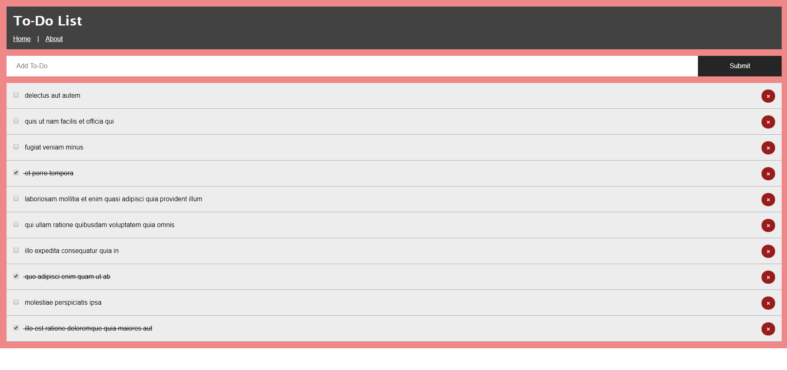

# My first React App

> Based on React JS Crash Course Tutorial https://www.youtube.com/watch?v=sBws8MSXN7A&list=WL&index=190&t=0s

## Screenshot

## About
* Pulls 10 todos from https://jsonplaceholder.typicode.com/todos
* Adds ToDo, "pushes" to https://jsonplaceholder.typicode.com/todos
* Deletes ToDo, "deletes" from https://jsonplaceholder.typicode.com/todos
* Marks as "completed"